# Pokemon Guess Who 🎮

A two-player online guessing game based on the classic "Guess Who?" game, featuring Pokemon from generations 1-5.

## Features

- 🎯 **Two-player online gameplay** with real-time synchronization
- 🌍 **Bilingual support** (English/French) for UI and Pokemon names
- 🎨 **Theme switching** (Light/Dark mode)
- 📱 **Responsive design** with configurable grid layouts (8×5 or 5×8)
- 🎲 **Seeded random generation** ensures both players see the same 40 Pokemon
- 🔍 **Rich Pokemon data** including types, generation, and evolution stage
- ⚡ **Fast loading** with static name translations (no runtime API calls for names)

## Tech Stack

- **Framework**: Next.js 16 (App Router)
- **Language**: TypeScript
- **Styling**: Tailwind CSS v4
- **UI Components**: Radix UI + shadcn/ui
- **Data Source**: PokéAPI
- **Real-time**: Server-Sent Events (SSE)

## Getting Started

### Prerequisites

- Node.js 18+
- npm or pnpm

### Installation

```bash
# Clone the repository
git clone https://github.com/harlet-victorien/pokemon-guess-who.git
cd pokemon-guess-who

# Install dependencies
npm install

# Set up environment variables
cp .env.local.example .env.local
# Edit .env.local with your configuration

# Run development server
npm run dev
```

Open [http://localhost:3000](http://localhost:3000) in your browser.

### Building for Production

```bash
npm run build
npm start
```

## How to Play

1. **Create or Join a Room**: Enter your name and a room code
2. **Wait for Opponent**: Share the room code with a friend
3. **Start Playing**: Both players see the same grid of 40 Pokemon
4. **Ask Questions**: Verbally ask yes/no questions about your opponent's Pokemon
5. **Eliminate Cards**: Click on Pokemon to mark them as eliminated
6. **Win**: Be the first to correctly guess your opponent's Pokemon!

## Project Structure

```
pokemon-guess-who/
├── app/                    # Next.js App Router pages
├── components/             # React components
├── contexts/               # React Context (settings, language)
├── lib/                    # Utilities and data fetching
│   ├── translations.ts    # UI translations (EN/FR)
│   ├── pokemon-names.ts   # Static Pokemon name translations
│   ├── pokemon.ts         # PokéAPI integration
│   └── rng.ts            # Seeded random number generation
├── scripts/               # Build scripts
│   └── generate-pokemon-names.js
├── types/                 # TypeScript type definitions
└── public/               # Static assets
```

## Translation System

The app features a dual-layer translation system:

- **UI Translations**: Lightweight custom i18n for interface text
- **Pokemon Names**: Static mapping of 649 Pokemon names (EN/FR) generated from PokéAPI

To regenerate Pokemon name translations:

```bash
node scripts/generate-pokemon-names.js
```

## Configuration

Settings are persisted in localStorage:
- Language preference (EN/FR)
- Theme (Light/Dark)
- Grid layout (8×5 or 5×8)

## API Routes

- `POST /api/room/[code]` - Create room
- `POST /api/room/[code]/join` - Join room
- `GET /api/room/[code]` - Room status (SSE)

## Contributing

Contributions are welcome! Please feel free to submit a Pull Request.

## License

MIT

## Solo Mode (vs AI)

A single-player mode where you play against an AI opponent powered by **LangChain** with provider-agnostic model switching.

### How it works

1. Click **"Play Solo vs AI"** from the home page
2. Enter your name — the game generates a board of 40 Pokemon
3. Pick your secret Pokemon
4. Take turns: ask a question OR guess (one action per turn)
5. First to guess correctly wins

### AI Agentic Architecture

All agents use LangChain's `init_chat_model()` with native tool calling. Switch providers by changing a single string in `agent/config.py`.

```mermaid
graph TD
    subgraph Frontend["Next.js Frontend"]
        UI[Game UI]
    end

    subgraph Proxy["Next.js API Routes"]
        P["/api/solo/*"]
    end

    subgraph Backend["FastAPI Backend"]
        R["Routes"]
        GS["GameSession<br/>(in-memory state)"]

        subgraph Orchestrator["Orchestrator Agent"]
            D{"candidates ≤ 3?"}
            ASK["Ask Mode<br/>temp: 0.7"]
            GUESS["Guess Mode<br/>temp: 0.3"]
        end

        subgraph Subagent["Subagent (Oracle)"]
            SA["Answer Agent<br/>temp: 0.0"]
            SE["Evaluate Agent<br/>temp: 0.0"]
        end

        subgraph Tools["LangChain Tools"]
            T1["ask_question(question)"]
            T2["guess_pokemon(pokemon_id)"]
            T3["answer_yes_no(answer)"]
            T4["evaluate_candidates(verdicts)"]
        end
    end

    UI -->|HTTP| P
    P -->|proxy| R
    R --> GS

    R -->|"AI turn"| D
    D -->|">3 candidates"| ASK
    D -->|"≤3 candidates"| GUESS
    ASK -->|tool call| T1
    GUESS -->|tool call| T2
    T1 -->|question| GS
    T2 -->|guess result| GS

    R -->|"Human asks question"| SA
    SA -->|tool call| T3
    T3 -->|"yes/no"| GS

    R -->|"Human answers AI question"| SE
    SE -->|tool call| T4
    T4 -->|"eliminate candidates"| GS

    style Orchestrator fill:#1e3a5f,stroke:#4a90d9,color:#fff
    style Subagent fill:#3a1e5f,stroke:#9b59b6,color:#fff
    style Tools fill:#1e5f3a,stroke:#2ecc71,color:#fff
```



**Supported providers** (change `MODEL` in `agent/config.py`):
| Provider | Model string | Env var |
|---|---|---|
| Google | `google_genai:gemini-2.0-flash` | `GOOGLE_API_KEY` |
| Anthropic | `anthropic:claude-haiku-4-5-20251001` | `ANTHROPIC_API_KEY` |
| OpenAI | `openai:gpt-4o` | `OPENAI_API_KEY` |
| Mistral | `mistral:mistral-large-latest` | `MISTRAL_API_KEY` |

### Code-Level Architecture

How each file maps to the agentic architecture:


**Call chain for each game action:**

| User action | Route | Function chain |
|---|---|---|
| AI's turn starts | `POST /ai-turn` | `ai_decide_and_act()` → `_ai_ask()` or `_ai_guess()` |
| Human answers AI | `POST /human-answer` | `ai_process_answer()` → `get_eliminations()` → `check_candidates()` |
| Human asks question | `POST /human-question` | `answer_human_question()` |
| Human guesses | `POST /human-guess` | direct comparison in route |
| Human ends turn | `POST /end-turn` | sets `phase = "ai_turn"` |

**Each function follows the same pattern:**
1. Load LLM from config via `init_chat_model(agent_def.model, temperature=agent_def.temperature)`
2. Bind tools via `llm.bind_tools([tool])`
3. Format prompt from `prompts.py` with session data
4. Invoke → parse `response.tool_calls` → fallback to text parsing if needed

### Running the AI backend

```bash
cd api-python
pip install -r requirements.txt
# Set your API key in .env (see .env for all supported providers)
uvicorn main:app --reload --port 8000
```

## Acknowledgments

- Pokemon data provided by [PokéAPI](https://pokeapi.co/)
- UI components from [shadcn/ui](https://ui.shadcn.com/)
- Type icons and sprites from Pokemon official sources
